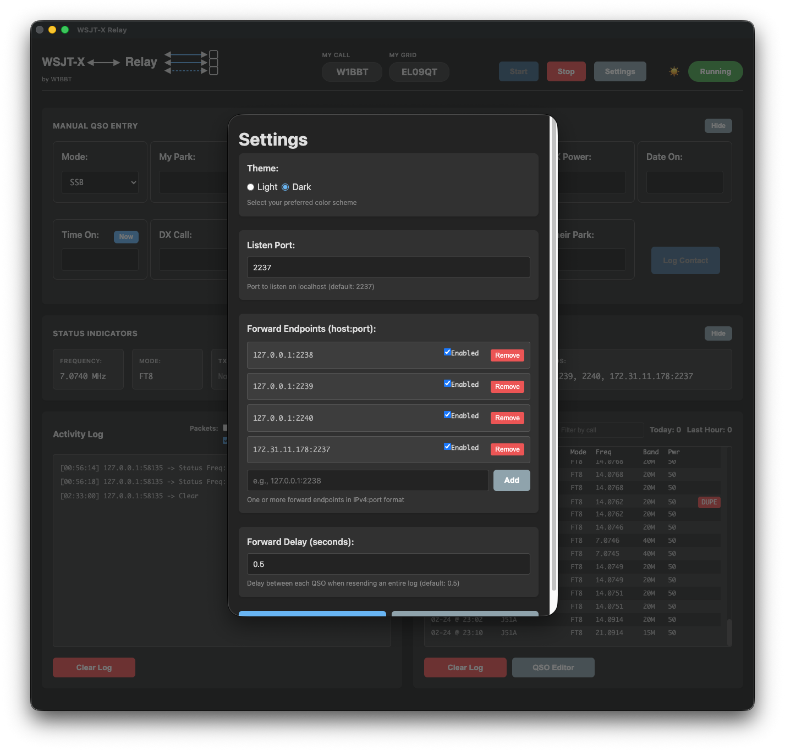
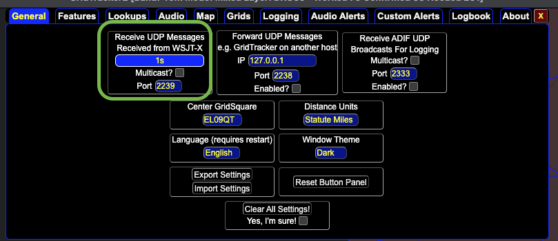

# WSJT-X Relay

WSJT-X Relay is a desktop app that sits between WSJT-X and the rest of your station software.

It lets WSJT-X send UDP traffic to multiple apps at once (for example GridTracker, Hamclock, N1MM+, and N3FJP), and gives you built-in tools for manual QSO logging and ADIF management.

## Quick Start

### 1) Launch or Install the app

#### From the `electron` folder:

```bash
npm install
npm start
```

#### Pre-built Distribution packages can be downloaded from https://hitechwizard.net/wsjtx-relay


### 2) Point WSJT-X to the relay

- In WSJT-X, set UDP output to the WSJT-X Relay listen port.
- Default listen port is `2237`.

### 3) Add your forwarding targets

- Open **Settings** in WSJT-X Relay.
- Add one or more targets in `host:port` format.
- For apps on the same computer, use `127.0.0.1` with unique ports (for example `127.0.0.1:2238`, `127.0.0.1:2239`).

### 4) Start relaying

- Click **Start** in the main window.
- You should see live status updates and relay activity in the log.

### 5) Log manual contacts (optional)

- Use the **Manual QSO Entry** section for SSB/CW or other non-digital contacts.
- Click **Log Contact** to store and forward the contact.

## Configuration Examples

The app includes a built-in **Help → Examples** page. The same example setup is documented here for quick reference.

### Example Topology

- WSJT-X send/receive on port **2237**.
- WSJT-X Relay listens on **2237** and relays to **2238**, **2239**, and **2240**.
- WRL CAT Control listens on **2238**.
- GridTracker listens on **2239**.
- openHamclock listens on **2240**.

**Important:** communication is bidirectional. Reply packets from downstream apps (for example GridTracker) are forwarded back through WSJT-X Relay to WSJT-X.

### Quick Flow (ASCII)

```text
WSJT-X (2237)
	⇄
WSJT-X Relay (listen 2237; relay 2238/2239/2240)
	⇄ WRL CAT Control (2238)
	⇄ GridTracker (2239)
	⇄ openHamclock (2240)
```

### Example Screenshots

1. **WSJT-X (UDP 2237)**  
	

2. **WSJT-X Relay (listen 2237, relay 2238/2239/2240)**  
	

3. **WRL CAT Control (2238)**  
	

4. **GridTracker (2239)**  
	

5. **openHamclock (2240)**  
	

## End-User Features

- **One-to-many UDP forwarding**: Receive WSJT-X UDP packets on one listen port and forward them to multiple endpoints (GridTracker, Hamclock, N1MM+, N3FJP, and others).
- **Bi-directional relay behavior**: Keeps packet routing working both directions so connected apps can continue exchanging WSJT-X traffic through the relay.
- **Simple start/stop control**: Start and stop the relay from the main window with clear running/stopped status.
- **Live status indicators**: View current frequency, mode, TX-enabled state, transmitting state, listen port, and active forward targets.
- **Activity log**: Monitor relay traffic and events in real time from the app.
- **Manual QSO entry**: Enter non-WSJT contacts (such as SSB/CW during POTA activations) directly in the app.
- **Built-in QSO log view**: Track logged contacts with running counts and recent activity.
- **QSO Editor window**: Review and edit saved QSOs in a dedicated editor.
- **ADIF import/export**: Import existing logs and export contacts for upload to other logging services.
- **Resend QSOs to forwarders**: Re-send one or all saved QSOs as needed.
- **Persistent settings**: Saved listen port, forward endpoints, theme, window size, and QSO data between sessions.
- **Light and dark themes**: Choose your preferred display theme.

## Using WSJT-X Relay as a Manual Logger

WSJT-X Relay can also log non-digital contacts. When you log a manual QSO, it is forwarded to your listening applications the same way as WSJT-X traffic. This helps keep downstream services (such as QRZ, LoTW, and Club Log) in sync without separate manual uploads.

### Manual QSO Operation

1. WSJT-X acts as CAT control and updates the frequency and band fields in the Manual QSO section. If you are operating SSB or CW, you can disable WSJT-X decoding with the **Monitor** button to reduce CPU usage and quiet the activity log.
2. Fill out the fields in the Manual QSO section and click **Log Contact**.

## QSO Log Editor

WSJT-X Relay includes a QSO Log Editor for importing and exporting ADIF files. This is especially useful for building POTA activation logs. You can also resend individual QSOs or the entire log to your forward targets. That makes it easy to operate without internet access and sync those QSOs later when connectivity is restored.


